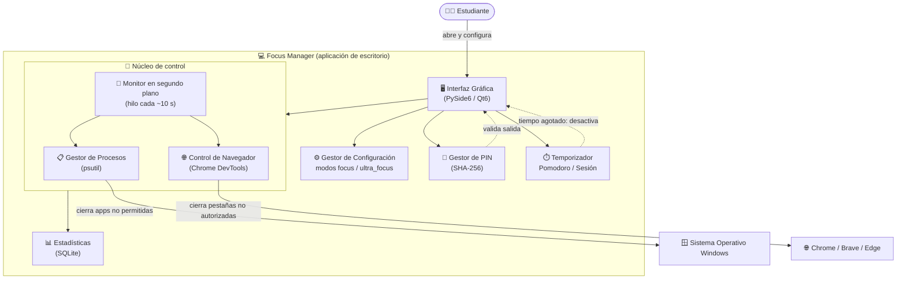
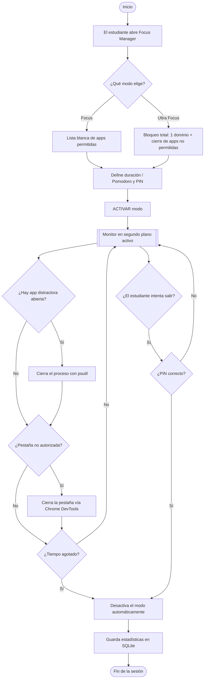
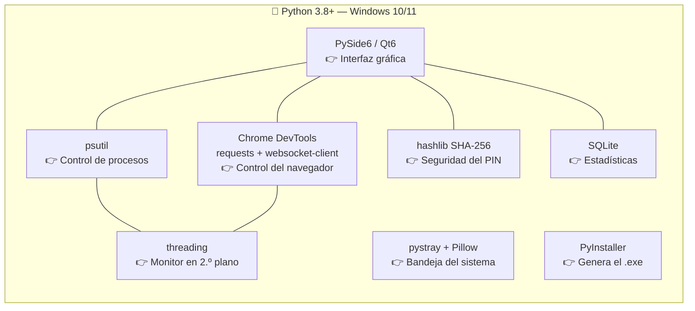

# Diagrama del Proyecto — Sistema de Bloqueo de Distracciones Digitales para Estudiantes

**Focus Manager**

Manuela Riascos Hurtado
Institución Universitaria Antonio José Camacho

---

## 1. ¿Cómo funciona la solución?

Focus Manager es una **aplicación de escritorio para Windows** que el estudiante activa
antes de empezar a estudiar. Al activar un modo de concentración, el programa hace tres
cosas de forma automática y continua:

1. **Cierra y bloquea aplicaciones distractoras** (Discord, Telegram, Spotify, TikTok,
   juegos, etc.) revisando los procesos del sistema operativo.
2. **Restringe el navegador** para que solo permita los sitios académicos autorizados,
   cerrando cualquier pestaña que no esté en la lista blanca.
3. **Controla el tiempo** mediante un temporizador o técnica Pomodoro, y **protege la
   salida con un PIN** para que el estudiante no pueda desactivar el bloqueo antes de
   tiempo.

Mientras el modo está activo, un **monitor en segundo plano** (un hilo de ejecución
independiente) revisa cada pocos segundos los procesos abiertos y las pestañas del
navegador, aplicando las reglas una y otra vez hasta que el tiempo termina o se ingresa
el PIN correcto.

### Diagrama general de la arquitectura



### Diagrama de flujo de una sesión de estudio



---

## 2. ¿Qué tecnología utiliza?

El proyecto está desarrollado en **Python** y funciona sobre **Windows 10/11**.

| Componente | Tecnología | ¿Para qué sirve? |
|---|---|---|
| Lenguaje | **Python 3.8+** | Lenguaje principal del proyecto |
| Interfaz gráfica | **PySide6 (Qt6)** | Ventanas, botones y diseño de la aplicación |
| Gestión de procesos | **psutil** | Detectar y cerrar las aplicaciones distractoras |
| Control del navegador | **Chrome DevTools Protocol** (vía `requests` y `websocket-client`) | Cerrar pestañas no autorizadas en Chrome / Brave / Edge |
| Seguridad / PIN | **hashlib (SHA-256)** | Guardar el PIN cifrado (control parental) |
| Estadísticas | **SQLite** | Registrar tiempo de estudio, sesiones y apps cerradas |
| Concurrencia | **threading** | Monitor en segundo plano sin congelar la interfaz |
| Bandeja del sistema | **pystray + Pillow** | Mantener la app accesible desde el ícono del reloj |
| Integración Windows | **pywin32** | Funciones específicas del sistema operativo |
| Empaquetado | **PyInstaller** | Generar el ejecutable `.exe` distribuible |

### Diagrama de componentes y tecnologías



---

## Cómo convertir estos diagramas en imágenes para el documento

Los diagramas están escritos en **Mermaid**. Para insertarlos en Word como imagen:

1. Entra a <https://mermaid.live>
2. Copia y pega el contenido de un bloque ` ```mermaid ` (sin las comillas).
3. Usa **Actions → PNG / SVG** para descargar la imagen.
4. Inserta la imagen en tu documento de Word.

> También se ven directamente en VS Code (con la extensión *Markdown Preview Mermaid*) y
> en GitHub sin instalar nada.
