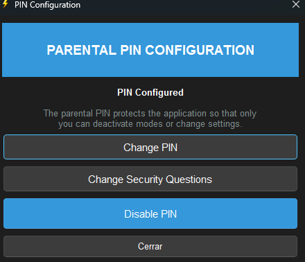

<h1 align="center">🎯 System Focus Manager</h1>

> **Copyright © 2025 Manuela Riascos Hurtado**
> A powerful productivity tool to help you stay focused by blocking distractions on Windows.


---

## 📖 Overview

System Focus Manager is a desktop application that helps you maintain focus by:
- 🚫 Blocking distracting applications
- 🌐 Controlling browser access with whitelists
- 🔒 Ultra Focus Mode – An exam-grade concentration lock, perfect for college exams, finals, and critical study sessions where discipline is mandatory.
- 📊 Tracking your productivity statistics
- 🔐 PIN protection to prevent bypassing focus modes

---

## 📸 Screenshots

<h3 align="center">System Focus Manager main interface</h3>
<p align="center">
  
</p>

<h3 align="center">Focus Mode with selective app blocking and browser control</h3>
<p align="center">
  
</p>

<h3 align="center">Ideal for virtual exams – Ultra Focus limits your access to a single domain for maximum concentration</h3>
<p align="center">
  
</p>

<h3 align="center">Choose your preferred browser for Focus sessions</h3>
<p align="center">
  
</p>

<h3 align="center">Control which websites are allowed during Focus Mode</h3>
<p align="center">
  
</p>

<h3 align="center">Set timers to automatically deactivate modes after a specific duration. The mode cannot be disabled until the timer ends, unless the user enters the PIN</h3>
<p align="center">
  
</p>

<h3 align="center">PIN protection ensures focus modes cannot be bypassed</h3>
<p align="center">
  
</p>

<h3 align="center">The audit trail allows you to detect whether the monitored user abruptly closed the program in any way, whether by restarting the PC or force-closing it through the task manager</h3>
<p align="center">
  
</p>


## 🎬 Demo Videos


<p align="center">
  <a href="https://youtu.be/SZE5E_Sm2EE">
    
  </a>
</p>


## ✨ Features

### 🎯 Focus Mode
- Block specific applications
- Whitelist allowed applications
- Browser control with URL whitelisting
- Automatic reopening of closed browsers
- Session statistics tracking

### 🔐 Ultra Focus Mode
- **Extreme concentration mode** - locks you to a single domain
- Only ONE browser allowed
- Automatically closes unauthorized applications
- **Cannot close the program** - Task Manager force-close is logged in audit trail
- **Requires PIN to exit** - Ensures the supervisor knows if the user exited
- **Audit trail monitoring** - Detects if program was force-closed or PC restarted
- Domain lockdown (e.g., only github.com for exams)
- **Anti-bypass protection** - Any exit attempt is permanently recorded

### 📊 Statistics
- Track time spent in each mode
- Monitor blocked applications
- View session history
- Audit log of all events
- Export data for analysis

### 🔒 Security
- **PIN protection for parental control** - requires PIN to both activate AND deactivate modes
- **Anti-bypass detection** - if user closes and reopens the app, they cannot activate modes without PIN
- **Supervisor verification** - ensures supervisor knows if the monitored user exited the program
- Encrypted PIN storage
- Security questions for PIN recovery
- Audit logging of all actions with tamper detection

---

## 🚀 Installation

### Prerequisites
- Windows 10/11
- Python 3.8 or higher

### Steps

1. **Clone this repository:**
```bash
git clone https://github.com/Elah2022/system-focus-manager.git
cd system-focus-manager
```

2. **Install dependencies:**
```bash
cd system_focus_manager
pip install -r requirements.txt
```

3. **Run the application:**
```bash
python main.py
```

---

## 🎮 Usage

### Activating Focus Mode

1. Launch System Focus Manager
2. Click on "Focus" or "Ultra Focus" button
3. Enter PIN if required (strict mode)
4. The mode will activate and start monitoring

### Configuring Modes

Edit the JSON files in `modes/` folder:
- `focus.json` - Focus mode configuration
- `ultra_focus.json` - Ultra Focus mode configuration

Example configuration:
```json
{
  "name": "Focus",
  "allowed_apps": [
    "chrome.exe",
    "Code.exe",
    "notepad.exe"
  ],
  "close": [
    "Discord.exe",
    "Spotify.exe"
  ]
}
```

### Browser Control

The application uses Chrome DevTools Protocol to control browser tabs:
- Automatically opens browsers in debug mode
- Closes unauthorized tabs
- Enforces domain restrictions in Ultra Focus

---

## 🛠️ Technology Stack

- **GUI**: PySide6 (Qt)
- **Process Management**: psutil
- **Browser Control**: Chrome DevTools Protocol (websocket)
- **Database**: SQLite

---

## 📁 Project Structure

```
system_focus_manager/
├── main.py                 # Entry point
├── gui.py                  # Main GUI interface
├── launcher.py             # Application launcher
├── process_manager.py      # Process control
├── stats.py                # Statistics tracking
├── pin_manager.py          # PIN management
├── _watermark.py           # Copyright protection
├── browser_focus/          # Browser control modules
│   ├── controller.py       # Chrome DevTools Protocol
│   └── monitor.py          # Browser monitoring
├── modes/                  # Mode configurations
│   ├── focus.json
│   └── ultra_focus.json
└── icons/                  # Application icons
```

---

## 🔧 Configuration

### Focus Mode Settings

- `allowed_apps`: List of allowed applications
- `close`: Applications to close on activation
- `strict_mode`: Requires PIN to deactivate
- `whitelist_enabled`: Enable browser URL whitelist

### Ultra Focus Settings

- `locked_domain`: Single allowed domain (e.g., "github.com")
- `selected_browser`: Browser to use (chrome/brave/edge)
- `require_pin_to_close_app`: Prevent closing without PIN

---

**⚠️ IMPORTANT**: All contributions must maintain copyright attribution to the original author (Manuela Riascos Hurtado).

---

## 📝 License

This project is licensed under the MIT License - see the [LICENSE](LICENSE) file for details.

**Attribution Requirements:**
- You MUST keep all copyright notices
- You MUST credit Manuela Riascos Hurtado as the original author
- You MUST include a link to this repository

See [NOTICE](NOTICE) file for complete legal information.

---

## 👤 Author

**Manuela Riascos Hurtado**
- GitHub: [@Elah2022](https://github.com/Elah2022)
- Email: manhurta54@gmail.com
- Project: [system-focus-manager](https://github.com/Elah2022/system-focus-manager)

---

## ⭐ Support

If you find this project useful:
- ⭐ Star this repository
- 🐛 Report bugs or request features
- 💰 Consider sponsoring development
- 📧 Send feedback to manhurta54@gmail.com

---

## 🙏 Acknowledgments

- Chrome DevTools Protocol for browser control
- PySide6 for the excellent Qt bindings
- psutil for process management capabilities
- The open-source community

---

## ⚠️ Disclaimer

This software is provided "as is" without warranty. Use responsibly and ensure you have appropriate permissions when using process control features.

---

## 📜 Copyright Notice

```
Copyright © 2025 Manuela Riascos Hurtado
All Rights Reserved

Original Author: Manuela Riascos Hurtado
Email: manhurta54@gmail.com
GitHub: https://github.com/Elah2022
```

**Unauthorized removal of copyright notices is prohibited.**

---

Made with ❤️ by Manuela Riascos Hurtado
