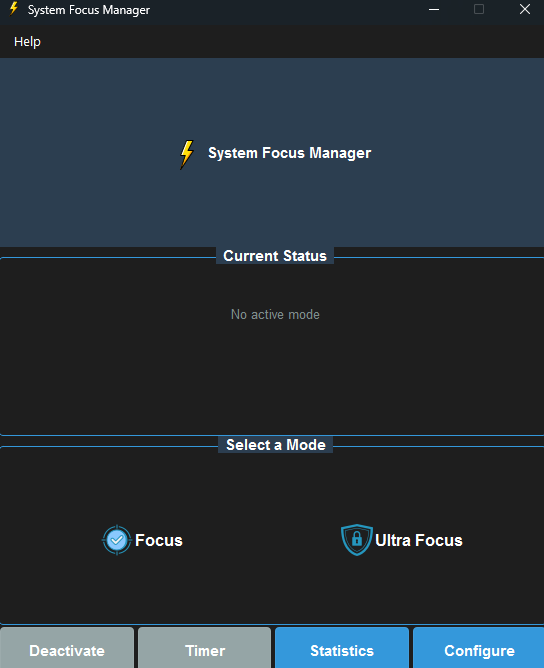
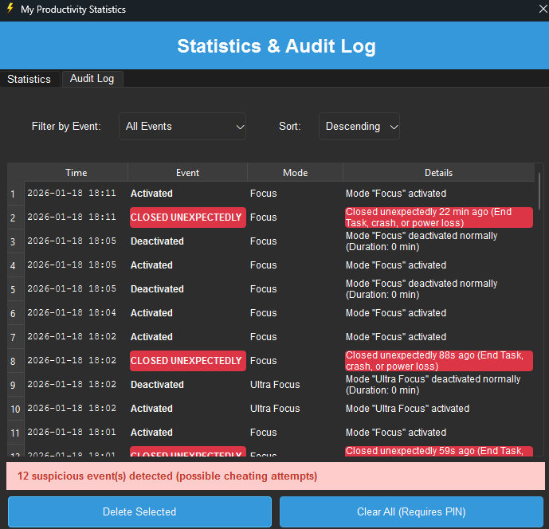
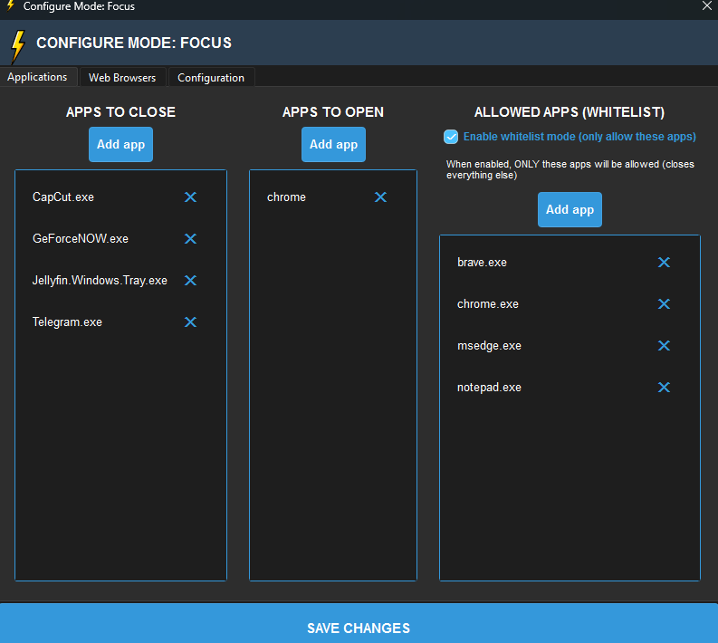
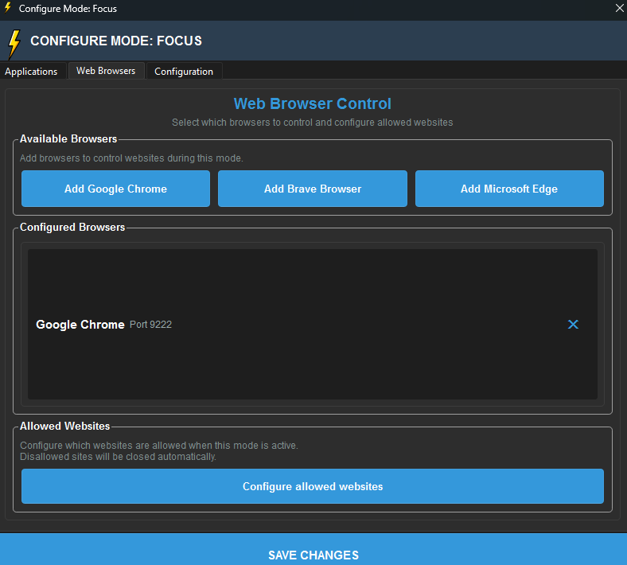

# 🎯 System Focus Manager

> **Copyright © 2025 Manuela Riascos Hurtado**
> A powerful productivity tool to help you stay focused by blocking distractions on Windows.


---

## 📖 Overview

System Focus Manager is a desktop application that helps you maintain focus by:
- 🚫 Blocking distracting applications
- 🌐 Controlling browser access with whitelists
- 🔒 Ultra Focus Mode – An exam-grade concentration lock, perfect for college exams, finals, and critical study sessions where discipline is mandatory.
- 📊 Tracking your productivity statistics
- 🔐 PIN protection to prevent bypassing focus modes

---

## 📸 Screenshots







---

## 🎬 Demo Videos

### 📹 How Focus Mode Works


> **Video Tutorial**: [Watch on YouTube](LINK_A_TU_VIDEO_AQUI)

### 📹 Ultra Focus in Action


> **Video Tutorial**: [Watch on YouTube](LINK_A_TU_VIDEO_AQUI)

### 📹 Complete Walkthrough
> **Full Tutorial**: [Watch on YouTube](LINK_A_TU_VIDEO_AQUI)
> This video covers installation, configuration, and all features.

---

## ✨ Features

### 🎯 Focus Mode
- Block specific applications
- Whitelist allowed applications
- Browser control with URL whitelisting
- Automatic reopening of closed browsers
- Session statistics tracking

### 🔐 Ultra Focus Mode
- **Extreme concentration mode** - locks you to a single domain
- Only ONE browser allowed
- Blocks ALL keyboard shortcuts (Alt+Tab, Win, Ctrl+Shift+Esc, etc.)
- Automatically closes unauthorized applications
- Requires PIN to exit
- Domain lockdown (e.g., only github.com)

### 📊 Statistics
- Track time spent in each mode
- Monitor blocked applications
- View session history
- Audit log of all events
- Export data for analysis

### 🔒 Security
- PIN protection for parental control
- Encrypted PIN storage
- Security questions for PIN recovery
- Audit logging of all actions

---

## 🚀 Installation

### Prerequisites
- Windows 10/11
- Python 3.8 or higher

### Steps

1. **Clone this repository:**
```bash
git clone https://github.com/Elah2022/system-focus-manager.git
cd system-focus-manager
```

2. **Install dependencies:**
```bash
cd system_focus_manager
pip install -r requirements.txt
```

3. **Run the application:**
```bash
python main.py
```

---

## 📦 Build Executable

To create a standalone executable:

```bash
cd system_focus_manager
pyinstaller --name="FocusManager" --windowed --onefile --icon=icons/logo.ico main.py
```

The executable will be in the `dist/` folder.

-------

## 🎮 Usage

### Activating Focus Mode

1. Launch System Focus Manager
2. Click on "Focus" or "Ultra Focus" button
3. Enter PIN if required (strict mode)
4. The mode will activate and start monitoring

### Configuring Modes

Edit the JSON files in `modes/` folder:
- `focus.json` - Focus mode configuration
- `ultra_focus.json` - Ultra Focus mode configuration

Example configuration:
```json
{
  "name": "Focus",
  "allowed_apps": [
    "chrome.exe",
    "Code.exe",
    "notepad.exe"
  ],
  "close": [
    "Discord.exe",
    "Spotify.exe"
  ]
}
```

### Browser Control

The application uses Chrome DevTools Protocol to control browser tabs:
- Automatically opens browsers in debug mode
- Closes unauthorized tabs
- Enforces domain restrictions in Ultra Focus

---

## 🛠️ Technology Stack

- **GUI**: PySide6 (Qt)
- **Process Management**: psutil
- **Browser Control**: Chrome DevTools Protocol (websocket)
- **Database**: SQLite
- **Keyboard Blocking**: keyboard library

---

## 📁 Project Structure

```
system_focus_manager/
├── main.py                 # Entry point
├── gui.py                  # Main GUI interface
├── launcher.py             # Application launcher
├── process_manager.py      # Process control
├── stats.py                # Statistics tracking
├── pin_manager.py          # PIN management
├── _watermark.py           # Copyright protection
├── browser_focus/          # Browser control modules
│   ├── controller.py       # Chrome DevTools Protocol
│   ├── monitor.py          # Browser monitoring
│   └── keyboard_blocker.py # Keyboard shortcut blocking
├── modes/                  # Mode configurations
│   ├── focus.json
│   └── ultra_focus.json
└── icons/                  # Application icons
```

---

## 🔧 Configuration

### Focus Mode Settings

- `allowed_apps`: List of allowed applications
- `close`: Applications to close on activation
- `strict_mode`: Requires PIN to deactivate
- `whitelist_enabled`: Enable browser URL whitelist

### Ultra Focus Settings

- `locked_domain`: Single allowed domain (e.g., "github.com")
- `selected_browser`: Browser to use (chrome/brave/edge)
- `block_all_shortcuts`: Block all keyboard shortcuts
- `require_pin_to_close_app`: Prevent closing without PIN

---

## 🤝 Contributing

Contributions are welcome! Please:

1. Fork the project
2. Create your feature branch (`git checkout -b feature/AmazingFeature`)
3. Commit your changes (`git commit -m 'Add some AmazingFeature'`)
4. Push to the branch (`git push origin feature/AmazingFeature`)
5. Open a Pull Request

**⚠️ IMPORTANT**: All contributions must maintain copyright attribution to the original author (Manuela Riascos Hurtado).

---

## 📝 License

This project is licensed under the MIT License - see the [LICENSE](LICENSE) file for details.

**Attribution Requirements:**
- You MUST keep all copyright notices
- You MUST credit Manuela Riascos Hurtado as the original author
- You MUST include a link to this repository

See [NOTICE](NOTICE) file for complete legal information.

---

## 👤 Author

**Manuela Riascos Hurtado**
- GitHub: [@Elah2022](https://github.com/Elah2022)
- Email: manhurta54@gmail.com
- Project: [system-focus-manager](https://github.com/Elah2022/system-focus-manager)

---

## ⭐ Support

If you find this project useful:
- ⭐ Star this repository
- 🐛 Report bugs or request features
- 💰 Consider sponsoring development
- 📧 Send feedback to manhurta54@gmail.com

---

## 🙏 Acknowledgments

- Chrome DevTools Protocol for browser control
- PySide6 for the excellent Qt bindings
- psutil for process management capabilities
- The open-source community

---

## ⚠️ Disclaimer

This software is provided "as is" without warranty. Use responsibly and ensure you have appropriate permissions when using process control features.

---

## 📜 Copyright Notice

```
Copyright © 2025 Manuela Riascos Hurtado
All Rights Reserved

Original Author: Manuela Riascos Hurtado
Email: manhurta54@gmail.com
GitHub: https://github.com/Elah2022
```

**Unauthorized removal of copyright notices is prohibited.**

---

Made with ❤️ by Manuela Riascos Hurtado
