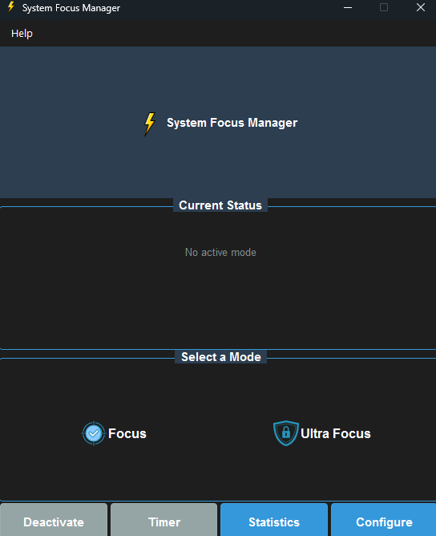
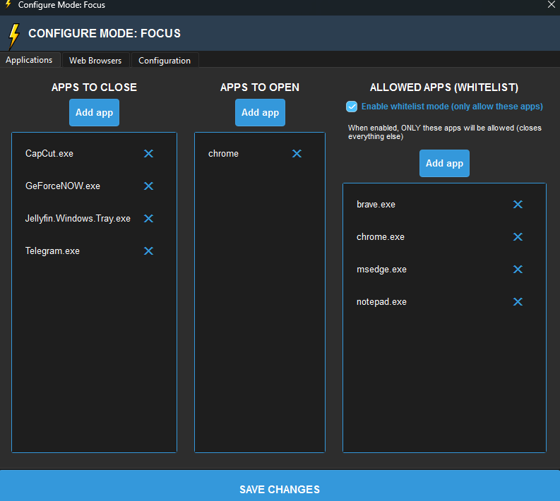
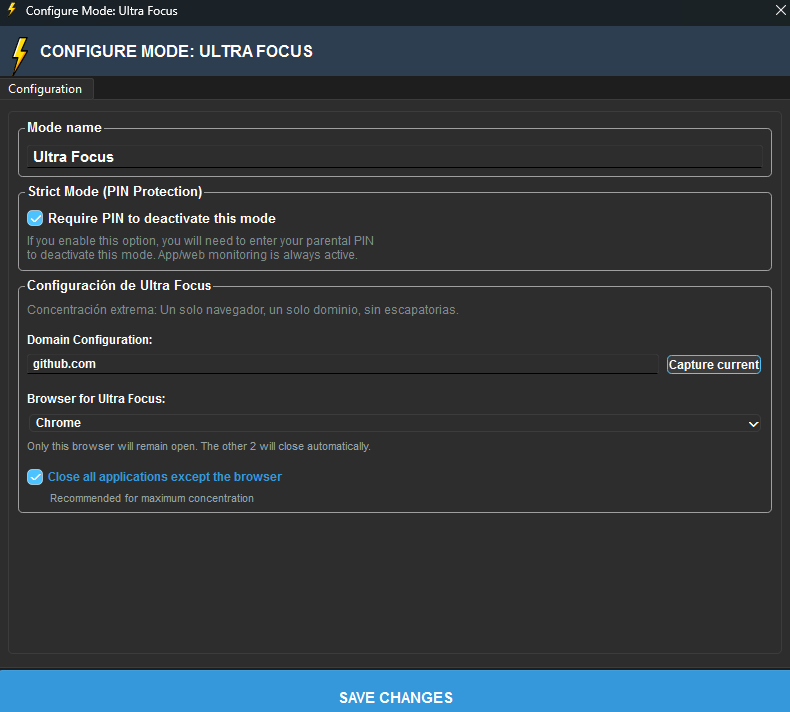
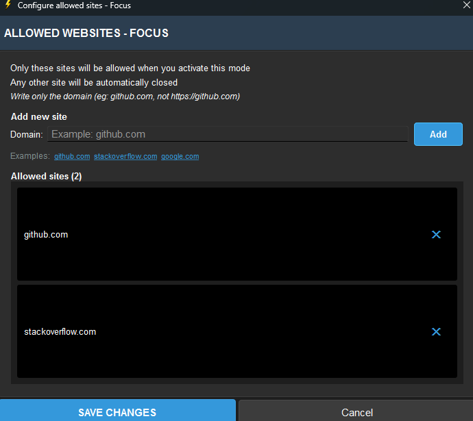
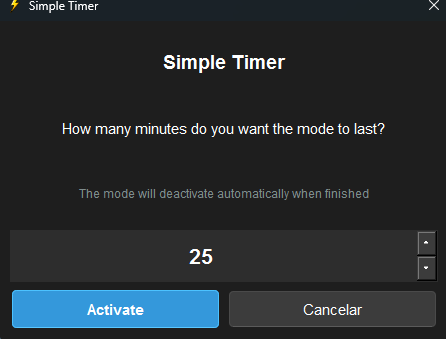
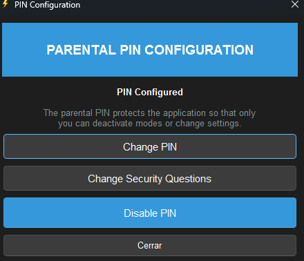
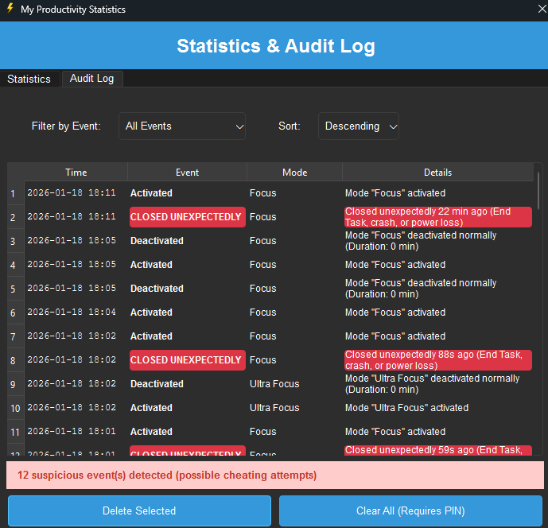

````md
<h1 align="center">⚡ System Focus Manager</h1>

<p align="center">
  <strong>Advanced productivity application with process control and browser domain locking for Windows.</strong>
</p>

<p align="center">
  A powerful desktop application built with Python and PySide6 that helps you maintain focus by blocking distractions, managing applications, and enforcing time-based work sessions.
</p>

<p align="center">
  
  
  
  
  
  
</p>

---

## 📸 Screenshots

<h3 align="center">Main Interface</h3>
<p align="center">
  
</p>

<h3 align="center">Focus Mode - Application Blocking and Browser Control</h3>
<p align="center">
  
</p>

<h3 align="center">Ultra Focus Mode - Single Domain Lockdown</h3>
<p align="center">
  
</p>

<h3 align="center">Browser Selection</h3>
<p align="center">
  
</p>

<h3 align="center">Website Whitelist Configuration</h3>
<p align="center">
  
</p>

<h3 align="center">Session Timer</h3>
<p align="center">
  
</p>

<h3 align="center">PIN Protection</h3>
<p align="center">
  
</p>

<h3 align="center">Tamper-Evident Audit Log</h3>
<p align="center">
  
</p>

---

## 🎬 Demo Video

<p align="center">
  <a href="https://youtu.be/SZE5E_Sm2EE">
    
  </a>
</p>

---

# ✨ Features

## 🔐 Ultra Focus Mode

- Lock browser to a single domain
- Automatic closure of unauthorized applications
- Browser forced into fullscreen
- Only one selected browser allowed (Chrome, Brave, or Edge)
- PIN-protected exit
- Tamper-evident audit logging

## 🎯 Focus Mode

- Block distracting applications
- Application whitelist support
- Browser monitoring and restrictions
- Customizable application rules
- Real-time statistics tracking

## 🍅 Pomodoro Timer

- Configurable work and break intervals
- Multiple cycles with automatic transitions
- Visual and notification alerts
- Automatic mode deactivation

## ⏱️ Session Timer

- Custom time limits
- Automatic deactivation
- Real-time countdown display

## 👨‍👩‍👧 Parental Controls

- PIN-protected settings and mode changes
- Prevent unauthorized deactivation
- Supervisor verification
- Secure PIN hashing and audit logging

---

# 🚀 Installation

## From Release (Recommended)

1. Download the latest release from GitHub Releases.
2. Run `focus-manager.exe`.
3. Grant necessary permissions when prompted.

> Windows Defender may flag the executable because it is unsigned. Click **More info → Run anyway** to continue.

## From Source

```bash
git clone https://github.com/Elah2022/system-focus-manager.git
cd system-focus-manager
pip install -r requirements.txt
cd system_focus_manager
python main.py
````

### Prerequisites

* Windows 10/11
* Python 3.8+

---

# 📖 Usage

## Quick Start

1. Launch the application.
2. Configure a mode.
3. Activate Focus or Ultra Focus.
4. Use Pomodoro or Session Timer.
5. Stay focused while the application enforces your rules.
6. Deactivate the mode (PIN may be required).

## Ultra Focus Setup

1. Click **⚙️ Configure** on Ultra Focus.
2. Enter the allowed domain (example: `github.com`).
3. Select the browser.
4. Save and activate.

## PIN Protection

1. Open **PIN Settings**.
2. Create a four-digit PIN.
3. Enable Parental Mode if desired.
4. PIN verification is required to modify or deactivate protected settings.

---

# 🏗️ Architecture

## Technology Stack

* GUI: PySide6 (Qt6)
* Browser Control: Chrome DevTools Protocol
* Process Management: psutil
* Security: PBKDF2-HMAC-SHA256 + HMAC-signed audit log

## Project Structure

```text
system_focus_manager/
├── browser_focus/
│   ├── __init__.py
│   ├── chrome_finder.py
│   ├── controller.py
│   ├── monitor.py
│   ├── multi_browser.py
│   └── rules.json
├── docs/screenshots/
├── icons/
├── modes/
│   ├── focus.json
│   └── ultra_focus.json
├── scripts/
│   └── check_audit.py
├── tests/
├── _watermark.py
├── about_dialog.py
├── browser_whitelist_window.py
├── config_window.py
├── gui.py
├── launcher.py
├── logger.py
├── main.py
├── pin_dialog.py
├── pin_manager.py
├── process_manager.py
├── requirements-dev.txt
├── requirements.txt
├── settings.json
├── settings_manager.py
├── stats_manager.py
├── stats_window.py
├── stats_window_new.py
├── system_tray.py
├── translations.py
├── LICENSE
├── NOTICE
└── README.md
```

---

# 🔒 Security

* PBKDF2-HMAC-SHA256 PIN hashing with random salt
* PIN-protected parental mode
* Unauthorized application termination in Ultra Focus Mode
* HMAC-chained audit logs capable of detecting edits, deletions and entry reordering

---

# 📊 Statistics

The application tracks:

* Total time spent in each mode
* Number of sessions
* Blocked applications
* Historical sessions with timestamps

---

# 🧪 Testing

```bash
pytest
```

---

# 🛠️ Building Executable

```bash
pip install pyinstaller
pyinstaller --onefile --windowed --icon=assets/icon.ico main.py
```

Output:

```text
dist/main.exe
```

---

# 🗺️ Roadmap

* [ ] Improve system tray experience
* [ ] Dark theme
* [ ] Export statistics (CSV)
* [ ] Preset configurations
* [ ] Sound notifications
* [ ] Cross-platform support

---

# 👤 Author

**Manuela Riascos Hurtado**

* GitHub: https://github.com/Elah2022
* Portfolio: https://manuelariascos.vercel.app
* Email: [manhurta54@gmail.com](mailto:manhurta54@gmail.com)

---

## ⭐ Support

If you find this project useful:

* ⭐ Star this repository
* 🐛 Report bugs and request features
* 💡 Share feedback and suggestions

---

<p align="center">
Built and maintained by <strong>Manuela Riascos Hurtado</strong><br>
Python • PySide6 • psutil • Chrome DevTools Protocol
</p>
```
